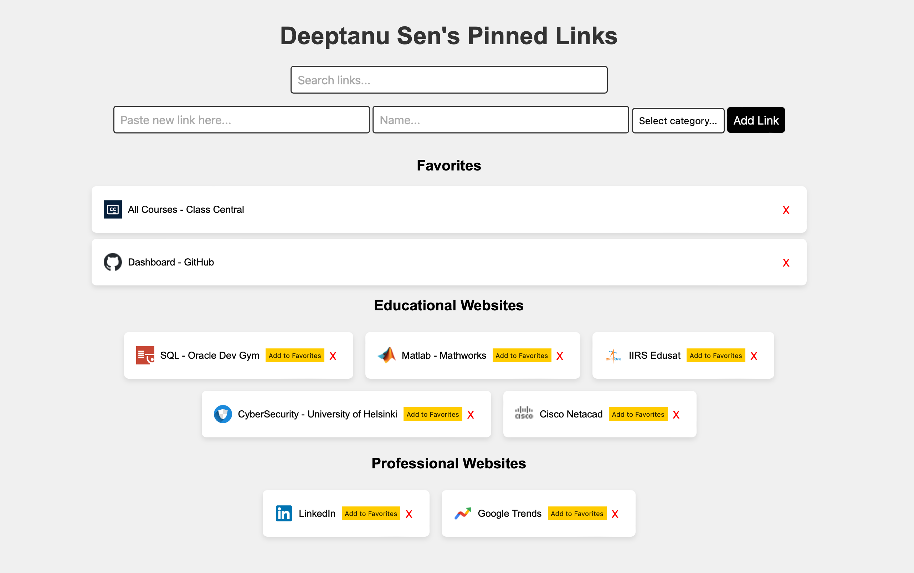

# Pinned Links Manager

Pinned Links Manager is a simple web application designed to help you manage and categorize your favorite links. Whether it's educational resources, professional websites, or any other URLs you frequently visit, this tool allows you to organize them efficiently.



## Version

Current Version: [v0.1.0-beta](https://github.com/Deeptanu2005/Pinned-Links-Manager/releases/tag/v0.1.0-beta)

**Full Changelog**: https://github.com/Deeptanu2005/Pinned-Links-Manager/commits/v0.1.0-beta

## Features

- **Add Links:** Easily add new links by pasting the URL and providing a name and category.
- **Categorization:** Organize your links into educational, professional, or custom categories.
- **Favorites:** Mark your favorite links for quick access.
- **Search:** Find specific links quickly with the built-in search functionality.
- **Responsive:** Responsive design ensures optimal viewing and interaction across various devices.

## Installation

1. Clone the repository:

   ```bash
   git clone https://github.com/your-username/Pinned-Links-Manager.git
   ```

2. Open `index.html` in your web browser.

## Usage

1. **Adding Links:**
- Paste the URL of the link you want to add.
- Provide a name for the link.
- Select a category (educational, professional, or custom).

2. **Managing Links:**
- Click on the "Add Link" button to add the link.
- Use the "Add to Favorites" button to mark links as favorites.
- Click on the "X" button to remove a link.

3. **Searching:**
- Use the search bar to filter links by name.

## Beta Release

This project is currently in beta. While it's fully functional, there may be occasional bugs or limitations. Your feedback is highly appreciated as we work towards a stable release.

## Contributing

Contributions are welcome! If you have any ideas for improvements, new features, or bug fixes, feel free to open an issue or submit a pull request.

## License

This project is licensed under the [MIT License](LICENSE).

## Acknowledgements

- Favicon generation powered by [Google Favicon API](https://www.google.com/s2/favicons?sz=64&domain_url={url})
- Dropdown arrow icon by [Iconscout](https://iconscout.com/icon/drop-down-arrow-6)
- Inspiration and guidance from [OpenAI](https://openai.com) and the developer community.

## Developer

**Deeptanu Sen**
- Email: [deeptanusends2005@icloud.com](mailto:deeptanusends2005@icloud.com)

## Contact

For any inquiries or support, please contact the developer:

**Deeptanu Sen**
- Email: [deeptanusends2005@icloud.com](mailto:deeptanusends2005@icloud.com)
